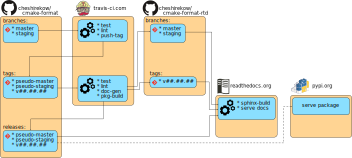

===============
Release Process
===============

.. default-role:: literal
.. highlight:: none

This page documents details of the cmake-format release process.

-------------
Update master
-------------

1. Push release candidate to the staging branch
2. travis will build and test the commit and then push the
   `pseudo-staging` tag
3. travis will build and test the commit, and will also create a new
   `psuedo-staging` release (`see here`__), pushing the binary artifacts
   (wheel, vsix, etc). Travis will also push a new commit to the
   `cmake-format-rtd` repository (`link`__) under the `staging` branch.
4. read-the-docs will build the documentation under the `staging` version,
   with `status here`__ and `result here`__
5. Download and install the python wheel and vsix packages. Test them manually
   to make sure everything looks good.
6. Push the same commit with that modification to the `master` branch. The
   same pipeline as above will execute. Double check there are no errors

-------------
Cut a Release
-------------

7. Add one commit on top of the `HEAD` of master, removing the `dev#`
   version suffix. Push to a tag.
8. The same pipeline above will execute, but this time the artifacts will
   belong to the real realease number. The release message text will be
   taken from the release notes document.
9. Download the python source and wheel distributions and vsix packages.
10. Push the python packages to test.pypi.org with::

     twine upload -r test cmake-format.*

11. Push the python packages to `pypi.org` with `twine upload cmake-format.*`
12. Push the vscode package with::

      vsce publish --baseImagesUrl \
      https://raw.githubusercontent.com/cheshirekow/cmake_format/master/cmake_format/vscode_extension

.. __: https://github.com/cheshirekow/cmake_format/releases/tag/pseudo-staging
.. __: https://github.com/cheshirekow/cmake-tools-rtd
.. __: https://readthedocs.org/projects/cmake-format/builds/
.. __: https://cmake-format.readthedocs.io/en/staging/
